## Seminario 1 -  Proyecto HolaGuate
#### Grupo13

### Integrantes

|   | NOMBRE                                      | CARNE     |
| - | ------------------------------------------- | --------- |
| 1 | Santiago Gilberto Antonio Rivadeneira Ruano | 201313722 |
| 2 | Edwin Alfredo Lopez Gomez                   | 201314007 |
| 3 | Wilfred Stewart Perez Solorzano             | 201408419 |
| 4 | Hector Josue Orozco Salazar                 | 201314296 |

## Link de la pagina
http://seminario1g13.tk/

# DESCRIPCION
Esta aplicacion esta dirigida para pequenas y medianas empresas, el objetivo principal es que se puedan dar a conocer, tanto los servicios que ofrecen como una ubicacion. Tomando como inspiracion las paginas de instagram y facebook en las cuales estas empresas pueden darse a conocer ante las personas. El cliente podra ingresar la informacion de su empresa en su idioma original ya que muchos duenos de empresas son de diferentes paises, y con el servicio de Translate puede el cliente verlo en maximo 3 idiomas diferentes.

# Arquitectura

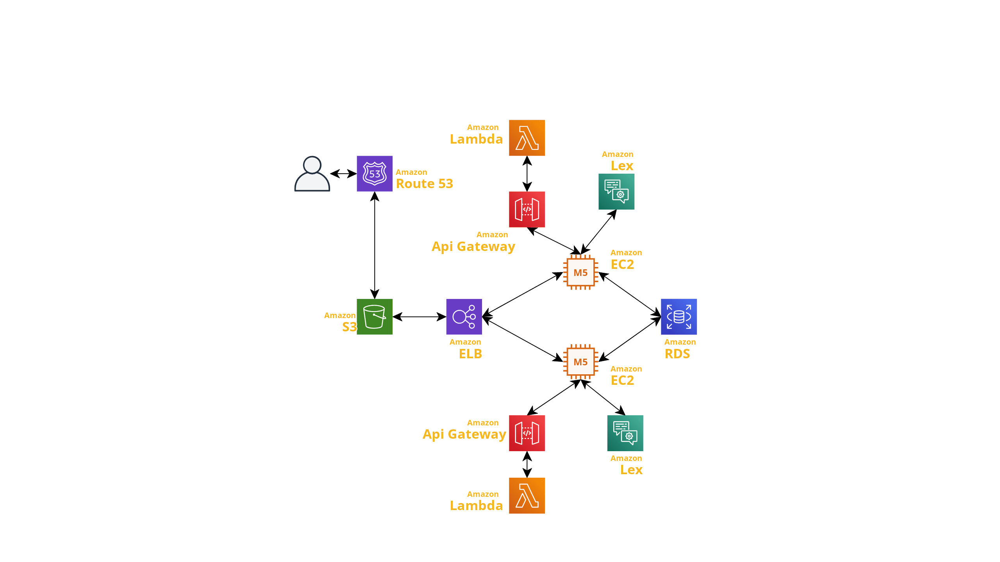

 
* EC2
     Fueron utilizadas para realizar los servidores del backend, en los cuales uno fue implementado en NodeJS y el otro en python. 

* Bucket Imagenes
     Bucket es el contenedor que Amazon S3 nos proporciona para el almacenamiento de objetos
    tales como archivos y metadatos 

    La apliacion FAUNADEX tendra la utilizacion de un bucket de Amazon S3 para el almacenamiento 
    de las imagenes utilzadas por los usuarios dentro de esta aplicacion, con el fin de tener
    un pyme desentralizado y publico, para el acceso de las diferentes API'S implementadas para
    este servicio, asi poder tener un resguardo de los datos con un nivel de integridad y 
    confiabilidad, disponibilidad de estos mismo

* Base de Datos
     Se utilizó una base de datos tradicional RDS con un servidor SQL Server en el cual se diseñó un modelo relacional y se crearon procedimientos almacenados en los que se realizaron transacciones para el manejo de los datos.

* Amazon Translate
     Se implemtado el servicio de Amazon Transalte de traduccion automatica neuronal el cual amazon ofrece una traduccion de idioms rentalbe y personalizable, el cual se ha implementado en la traduccion de las descripciones que pueden poseer las imagenes dentro de la aplicacion. 

* Rekognition
     La aplicacion cuentan con la integracion de Amazon REkognitcion el cual facilita la incorporacion del analisis de imagen y video dentro de esta aplicacion. El cual tiene su implenteo en el segundo metodo de login dentro de esta en el cual permitira a los usuario poder ingresar por medio de una camar web la cual aplicara el reconocimiento facial con la imagen de perfil.

* Amazon lex
     Tecnologia de vz y audio de compresion de lenguaje natrual(NLU), dicha tecnologia es implementada en el chatbot personalizado que cuenta la aplicacion para poder ayudar a los usuario con ayudas rapidas

* AWS Lambda
     AWS Lambda es un servicio informático sin servidor que ejecuta código como respuesta a eventos y administra automáticamente los recursos informáticos subyacentes. Estos eventos pueden ser cambios de estado o una actualización, como que un usuario coloque un artículo en un carrito de la compra en un sitio web de comercio electrónico.

* Load Balancer
     Elastic Load Balancing distribuye automáticamente su tráfico entrante entre varios destinos, como instancias EC2, contenedores y direcciones IP, en una o más zonas de disponibilidad. Supervisa el estado de sus objetivos registrados y enruta el tráfico solo a los objetivos en buen estado. Elastic Load Balancing escala su balanceador de carga a medida que su tráfico entrante cambia con el tiempo. 

# Usuarios IAM
* Usuario S3
Se creo un usuario con permisos de acceso a S3 para la gestion del Bucket en donde se encuentran las imagenes y paginas web, perteneciente al gurpo practica1-G13-S3.
El permiso utilizado para este usuario es: AmazonS3FullAcces
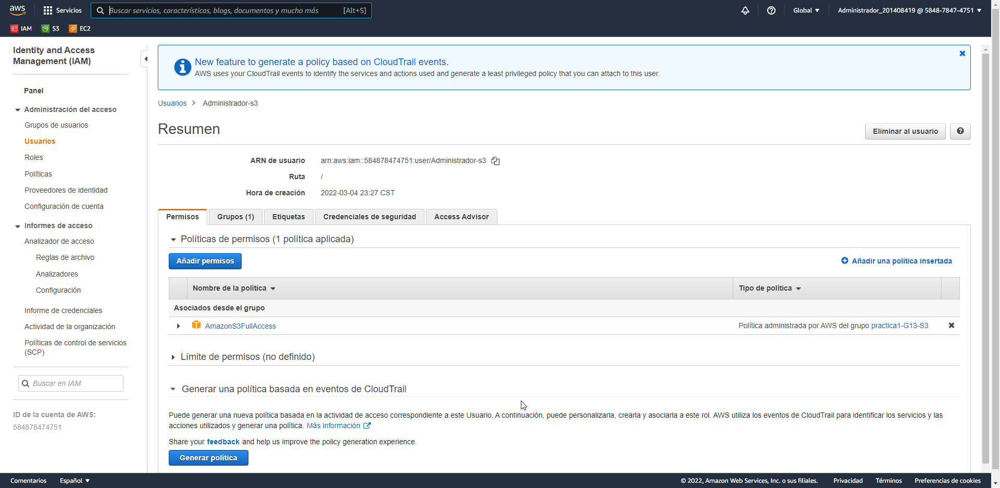

* Usuario ec2
Se creo un usuario con permisos de acceso a ec2 con la cual se gestiono cada una de las vpc en las que se encuentran alojando los servidores de nodejs y python correspondientes, perteneciente al gurpo practica1-G13-S3.
El permiso utilizado para este usuario es: AmazonEC2FullAcces
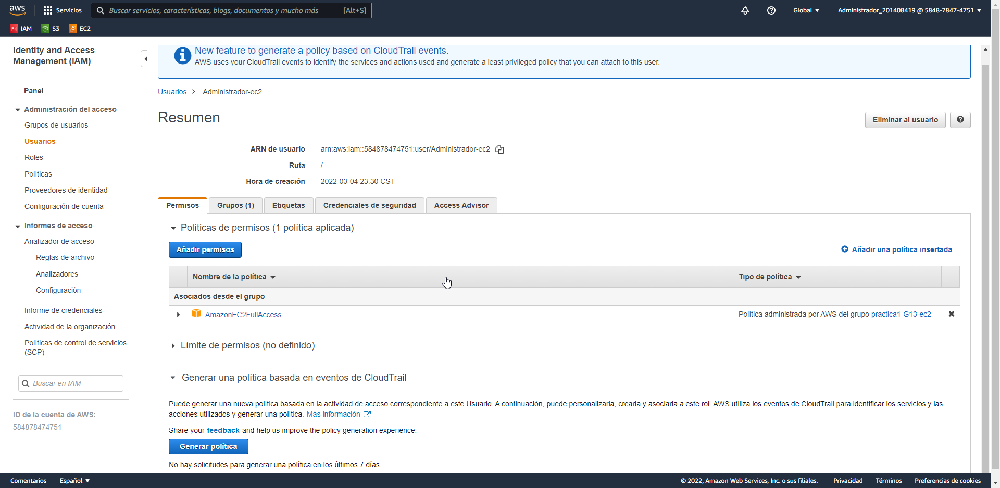

* Usuario AmazonLexFullAccess
Se realizacio la creacion deun usuario con permisos para amazonlex  el cual tiene la funcionalidad poder dar conexion a los servicio del chatbot.
El permiso utilizado para este usuario es: AmazonLexFullAccess

# Bucket S3

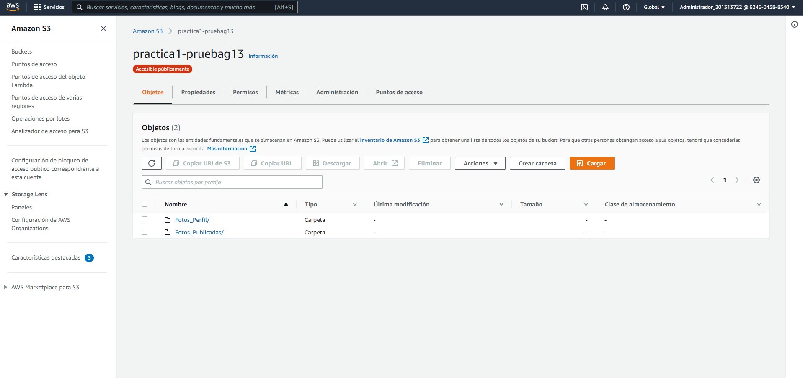

# EC2
* Instancia utilizada para montaje del servidor de nodejs.
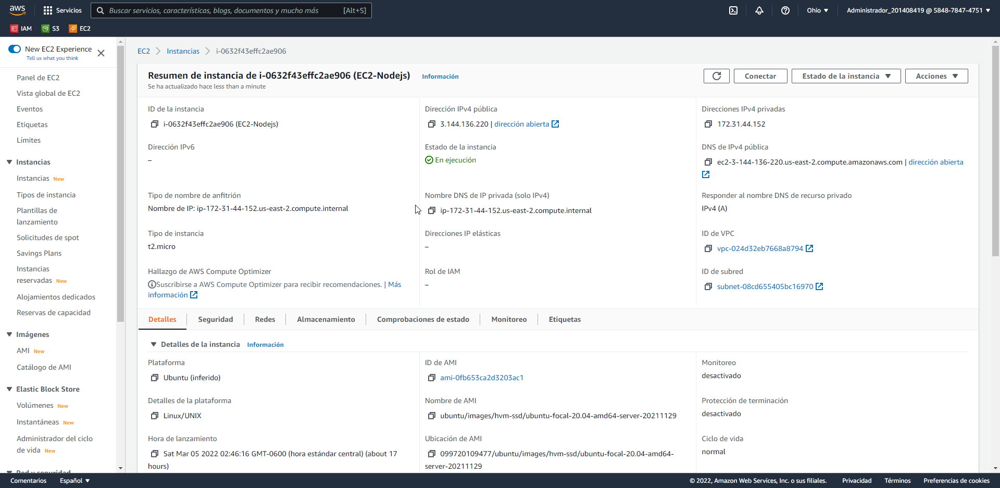
* Instancia utilizada para montaje del servidor de python.
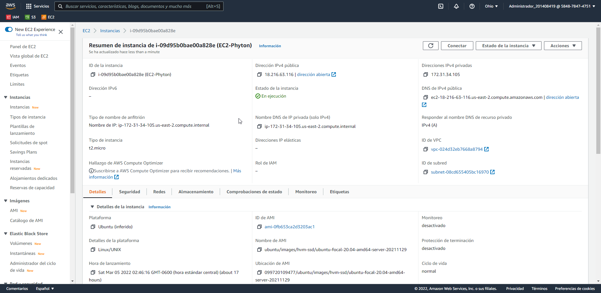

# RDS
Se creo un usuario con permisos de acceso a la base de datos relacional utilizando la base de datos de SQLserver, perteneciente al gurpo practica1-G13-S3.
El permiso utilizado para este usuario es: AmazonRDSFullAccess

# Aplicacion Web

* Login
    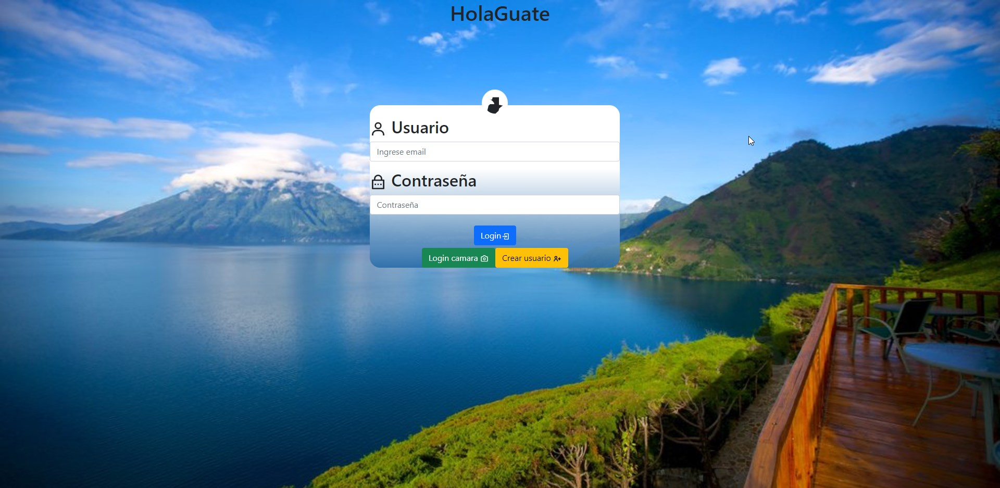

* Login camara
    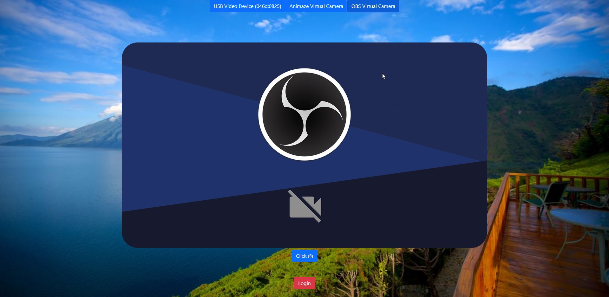

* home
    

* favoritos
    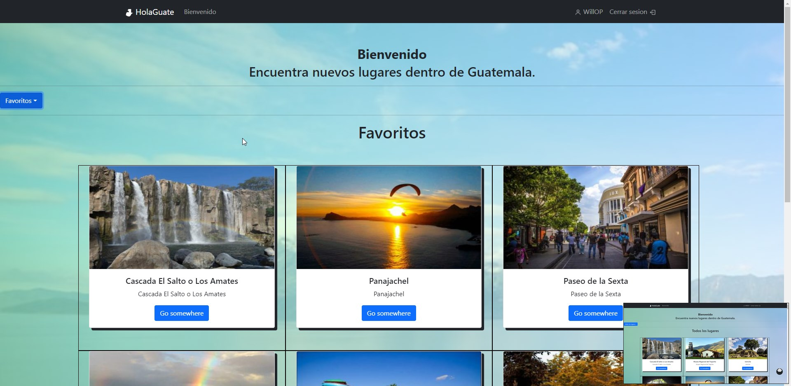

* crear
    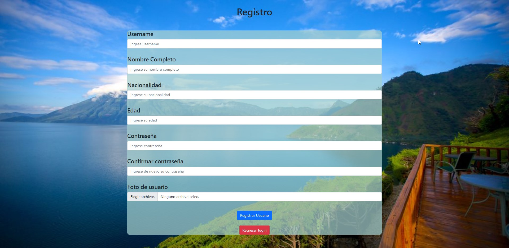

* chatBot
    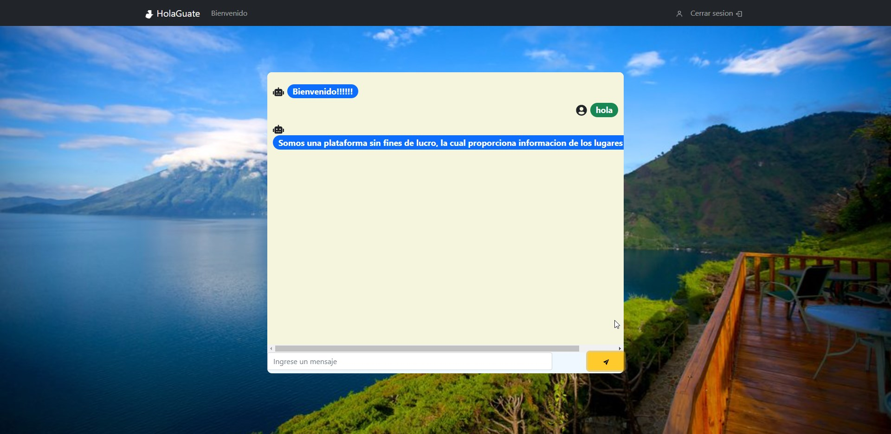
